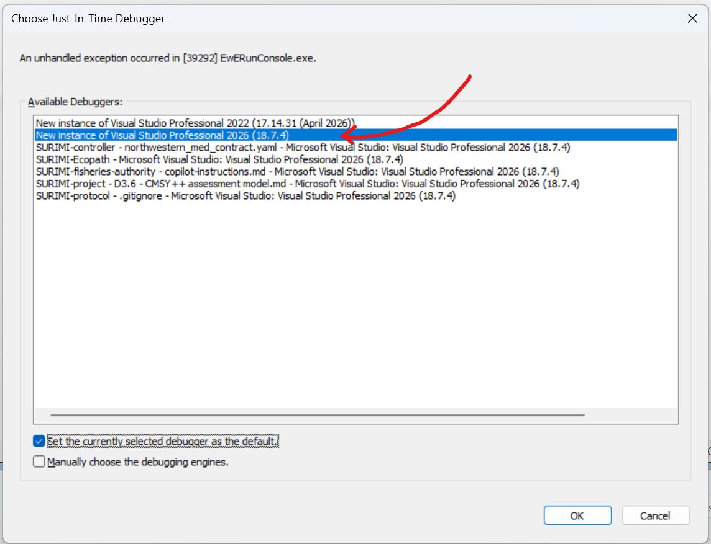

# Eii.Ecopath.Runner.Console.Tests

Integration tests for `EwERunConsole`. Each test launches `EwERunConsole.exe` as a
**separate child process** via `cConsoleRunner` and inspects its exit code, stdout,
and stderr.

## Debugging EwERunConsole.exe from a test

Because `EwERunConsole.exe` runs in its own process, breakpoints set in
`Eii.Ecopath.Runner.Console\Program.cs` (or anywhere in that project) will **not**
be hit by simply debugging a test in Test Explorer — the debugger is attached to
the test host process, not to the child `EwERunConsole.exe` process.

To debug into `EwERunConsole.exe`, use the built-in `EWE_DEBUG_BREAK` debug hook:

1. `Program.Main` in `Eii.Ecopath.Runner.Console\Program.cs` calls
   `Debugger.Launch()` when the `EWE_DEBUG_BREAK` environment variable is set to
   `1`. `cConsoleRunner` forwards this variable from the test process's
   environment into the `EwERunConsole.exe` child process if present.
2. Enable the variable for the test run via the `.runsettings` file at the
   solution root:
   ```xml
   <RunSettings>
     <RunConfiguration>
       <EnvironmentVariables>
         <EWE_DEBUG_BREAK>1</EWE_DEBUG_BREAK>
       </EnvironmentVariables>
     </RunConfiguration>
   </RunSettings>
   ```
   Select it in Visual Studio via **Test > Configure Run Settings > Select
   Solution Wide runsettings File**.
3. Set your breakpoint(s) in the Console project.
4. Debug the test (**Debug Selected Tests**). When `EwERunConsole.exe` starts,
   `Debugger.Launch()` fires and Windows prompts you to pick a debugger to
   attach — choose the running Visual Studio instance. Execution then pauses
   and your breakpoints will hit.
   
5. **Remember to deselect the `.runsettings` file** (**Select Solution Wide
   runsettings File > (none)**) once you're done, so normal test runs aren't
   affected by the extra debug prompt.
