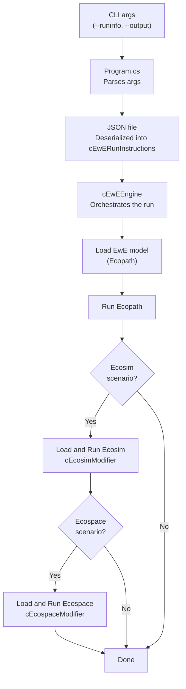
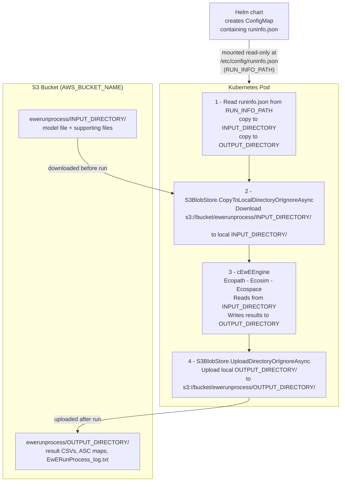

# Eii.Ecopath.Runner

Headless, JSON-driven runner for the [EwE (Ecopath with Ecosim)](https://ecopath.org) marine
ecosystem modelling platform. Automates sequential runs of Ecopath, Ecosim, Ecospace and
Ecotracer without the GUI.

## Solution structure

| Project | Description |
|---|---|
| `Eii.Ecopath.Runner.Console` | CLI executable (`EwERunConsole`) |
| `Eii.Ecopath.Runner.Api` | ASP.NET Core Web API (`EwERunApi`) |
| `Eii.Ecopath.Runner.RunProcess` | Containerised batch runner (`EwERunProcess`) |
| `Eii.Ecopath.Runner.Services` | Runtime engine, modifiers, automation node tree |
| `Eii.Ecopath.Runner.Datamodel` | Plain data containers deserialised from JSON |

---

# Eii.Ecopath.Runner.Console

Automation run console for EwE. Driven by a JSON run-info file passed on the command line.

**Usage**
```bash
EwERunConsole --runinfo path/to/runinfo.json --output path/to/output
```

**Flow**



---

# Eii.Ecopath.Runner.Api

ASP.NET Core Web API wrapper. Accepts the same JSON run-info as a `POST /eweRun` body and
delegates to `cEwEEngine`.

## Build and push Docker image

Set the required token once as a persistent user environment variable:
```powershell
[System.Environment]::SetEnvironmentVariable('DOCKER_BUILD_GITHUB_TOKEN', 'your-token', 'User')
```

Then run the build-push script:
```powershell
.\Eii.Ecopath.Runner.Api\tools\build-push-docker.ps1
```

---

# Eii.Ecopath.Runner.RunProcess

Containerised batch runner launched as a Kubernetes Job by the Process API.

## Build and push Docker image

```powershell
[System.Environment]::SetEnvironmentVariable('DOCKER_BUILD_GITHUB_TOKEN', 'your-token', 'User')
.\Eii.Ecopath.Runner.RunProcess\tools\build-push-docker.ps1
```

## File flow in a Kubernetes cluster



### Step-by-step

**1. Helm chart — runinfo.json**

The Helm chart creates a Kubernetes ConfigMap named `<release>-runinfo` containing `runinfo.json`.
The Job spec mounts it as a read-only volume at `/etc/config`:

```yaml
volumeMounts:
  - mountPath: /etc/config
    name: runinfo-volume
    readOnly: true
volumes:
  - name: runinfo-volume
    configMap:
      name: <release>-runinfo
```

The file is therefore available at `/etc/config/runinfo.json` — the value of `RUN_INFO_PATH`.

**2. Environment variables**

| Variable | Example value | Purpose |
|---|---|---|
| `RUN_INFO_PATH` | `/etc/config/runinfo.json` | Path to the mounted runinfo file |
| `INPUT_DIRECTORY` | `testdata/anchovybay` | Local directory for model input files |
| `OUTPUT_DIRECTORY` | `testoutput/anchovybay` | Local directory for run output files |
| `AWS_BUCKET_NAME` | `oidc-rikkert` | S3 bucket (derived from the Kubernetes namespace) |
| `AWS_S3_ENDPOINT` | `minio.dive.edito.eu` | S3-compatible endpoint |
| `AWS_DEFAULT_REGION` | `waw3-1` | S3 region |
| `AWS_ACCESS_KEY_ID` | *(loaded from Process API call)* | S3 credentials |
| `AWS_SECRET_ACCESS_KEY` | *(loaded from Process API call)* | S3 credentials |
| `AWS_SESSION_TOKEN` | *(loaded from Process API call)* | S3 credentials |

**3. runinfo.json is copied**

`EwERunProcessService` reads `runinfo.json` from `RUN_INFO_PATH` and copies it to
`INPUT_DIRECTORY` (so the engine resolves relative file paths correctly) and to
`OUTPUT_DIRECTORY` (for reference alongside the results).

**4. S3 to local (download)**

`S3BlobStore.CopyToLocalDirectoryOrIgnoreAsync` downloads all files from
`s3://<bucket>/ewerunprocess/<INPUT_DIRECTORY>/` into the local `INPUT_DIRECTORY`.
This includes the EwE model file (e.g. `AnchovyBay.eiixml`) and all supporting files.

**5. Engine run**

`cEwEEngine` sets the working directory to `INPUT_DIRECTORY` and runs
Ecopath, Ecosim, and Ecospace in sequence. All result files are written to `OUTPUT_DIRECTORY`.

**6. Local to S3 (upload)**

`S3BlobStore.UploadDirectoryOrIgnoreAsync` uploads the entire `OUTPUT_DIRECTORY` to
`s3://<bucket>/ewerunprocess/<OUTPUT_DIRECTORY>/`, including result files and
`EwERunProcess_log.txt` (the full console log of the run).

## Local debugging with Docker

Mount a local `testconfig/` folder containing `runinfo.json` to `/etc/config` inside the
container. In `launchSettings.json`, use `containerRunArguments` (not `additionalDockerRunArguments`):

```json
"Container (Dockerfile)": {
  "commandName": "Docker",
  "containerRunArguments": "-v C:/path/to/testconfig:/etc/config:ro",
  "environmentVariables": {
    "RUN_INFO_PATH": "/etc/config/runinfo.json"
  }
}
```


## Copy de S3 files to local 
To copy the files from S3 to you local machine you have to install a client. You can use any S3 client that supports the S3 protocol.
Important is that the client can use temporary creadentials (AWS_ACCESS_KEY_ID, AWS_SECRET_ACCESS_KEY, AWS_SESSION_TOKEN) and that it can use a custom endpoint (AWS_S3_ENDPOINT).

For example the MinIO CLI client: https://www.min.io/download/aistor-client

Download the file "mc.exe" and put it in a folder that is in your PATH. Like C:\Program Files\MinIO\mc.exe

### Set environment variables
Go to https://datalab.dive.edito.eu/account/storage and select the "MC Client" in the dropdown at the bottom.
Copy the export statement and modify it so it looks like this:
`set MC_HOST_s3=https://9FMY3P1O3OBHMWJJYIKT:2sudlwiruYGrqJm+fGpAxE+lOI4q etc. etc.`

Now the client is configured to use the correct endpoint and temporary credentials.

### Use the MinIO client to copy files from S3 to local
List the contents of the S3 bucket to verify that it works:
```bash 
mc ls s3/<bucket>/ewerunprocess/<INPUT_DIRECTORY>/
```

Then you can use the following command to copy the files from S3 to your local machine:
```bash
mc cp --recursive s3/<bucket>/ewerunprocess/<INPUT_DIRECTORY>/ <local_directory>
```