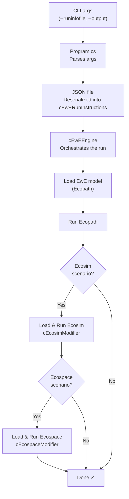

# Eii.Ecopath.Runner.Api


## Build Docker image

The EwERunApi docker image will be built and pushed to the GitHub Container Registry (ghcr.io) as part of the build process. 

It uses the environment variable DOCKER_BUILD_GITHUB_TOKEN to authenticate with GitHub and push the image to the registry.
So this environment variable must be set before running the build command. You can set it in the terminal using the following command:
```bash
$env:DOCKER_BUILD_GITHUB_TOKEN="your_github_token"
```

To build and push the EwERunApi docker image, run the following command in the terminal:

```bash
PS C:\Users\<user>\source\repos\Eii\Eii.Ecopath.Runner\Api> dotnet build /t:BuildPushDockerImage -v:detailed
```


# Eii.Ecopath.Runner.Console
Automation run console for EwE




# Eii.Ecopath.Runner.RunProcess

When the Docker image is started by the Process API, the runinfo JSON file is located at the path specified by the `RUN_INFO_PATH` environment variable.

For example: `/etc/config/runinfo.json`.
This file is copied to the `INPUT_DIRECTORY`.

Then it is deserialized into a `cEwERunInstructions` object, which is then passed to the `cEwEEngine` to orchestrate the run.